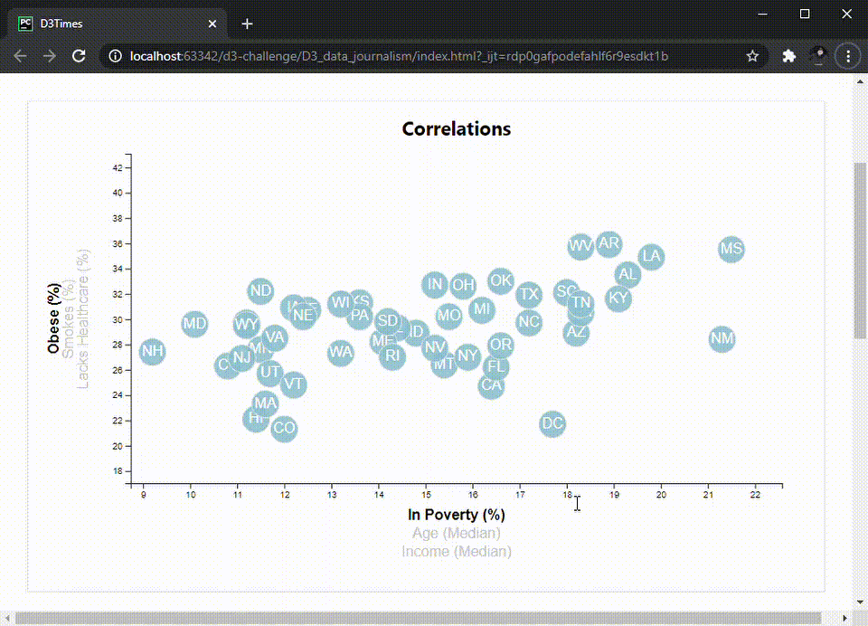

# D3 Challenge

### Overview

For this homework, the goal is to create a dynamic data visualization for some state-level census data using [D3.js](https://d3js.org/). The first goal is to create the chart and use data binding to populate circles for each state. On top of that, there are 2 bonus challenges:

 - Clickable axis labels that trigger transitions in both the axis scales and circle positions
 - Tooltips that pop up when you hover over the circles, displaying a summary of the data for that point
 
The final result looks something like this:
 
 
 
The starter code includes a static HTML skeleton, some CSS files, a CSV with all the data, and an empty JS file. All the libraries (Bootstrap, D3, etc) are brought in via CDNs.
 
I began with the bonus challenges in mind and worked backwards, starting with the clickable axis labels, since that's by far the more complicated. There are a few important considerations:
  
 - Some degree of global state management to keep track of the currently selected axis
 - Click listeners and conditional rendering (active vs inactive) on axis labels
 - An event handler for those listeners that determines what to do based on the above-mentioned state
 - Re-rendering functions for the axes and circles that the event handler can call
 
 ---
 
 ### Initial Build
 
 #### Creating the canvas
 
But first, I needed an `<svg>` element to be canvas for all of this, which requires only 2 attributes, a width and a height:
 
 ```
const svg = d3
    .select('#scatter')
    .append('svg')
    .attr('width', svgParams.tWidth)
    .attr('height', svgParams.tHeight);
```
 
Initially these were static values, but later I decided the width should be proportional to `window.innerWidth`. And inside it, I needed a `<g>` element to act as the parent of all the chart elements and define the bounds:
 
 ```
const chartGroup = svg.append('g')
    .attr('transform', `translate(${svgParams.mLeft}, ${svgParams.mTop})`);
```
 
Which means I needed to define some margins. The resulting logic looks like this:
 
 ```
const svgParams = {
    tWidth: window.innerWidth * 0.95,
    tHeight: 500,
    mTop: 40,
    mRight: window.innerWidth * 0.1,
    mBottom: 100,
    mLeft: window.innerWidth * 0.1,
};

svgParams.iWidth = svgParams.tWidth - svgParams.mRight - svgParams.mLeft;
svgParams.iHeight = svgParams.tHeight - svgParams.mTop - svgParams.mBottom;
```
 
That part can be done without the data, but everything else has to happen after the data is retrieved. Obviously, circles need the data to determine their positions, but the axes also need the data to build their scales, since we can't use the same scale for median income and percents.
 
 #### Linear ranges
 
The first step after retrieving the data (using `d3.csv`) and cleaning it up (to coerce strings to numbers) is to create those linear scales. I built a helper function that takes in the dataset and uses `d3.linearScale()` to determine the `domain` of the selected dataset (using `d3.min` and `d3.max`), and then its `range` based on whether it's the x or y axis:
 
 ```
function linearScale(axis, data) {
    const offset = axis === 'x' ? 0.05 : 0.2;
    return d3.scaleLinear()
        .domain([d3.min(data, d => d[selected[axis]]) * (1 - offset),
            d3.max(data, d => d[selected[axis]]) * (1 + offset)])
        .range(axis === 'x' ? [0, svgParams.iWidth] : [svgParams.iHeight, 0]);
}
```
 
The function returned by `linearRange` can then be used to determine the positions of everything else.
 
 #### Axes and ticks
 
First is the axis ticks, which D3 handles for you. You just need to build the `<g>` elements for each axis and pass them the result of calling `d3.axisBottom` or `d3.axisLeft`, with the linear scale as the sole argument:
 
```
let xScale = linearScale('x', chartData);
let xAxis = chartGroup.append('g')
    .classed('x-axis', true)
    .attr('transform', `translate(0, ${svgParams.iHeight})`)
    .call(d3.axisBottom(xScale));
```
 
 #### Axes labels
 
Because I started with the bonus in mind, I started out by creating `<g>` elements to contain the 3 x labels and 3 y labels. Then I called `forEach` loop on an array of "tuples" containing the key for each label and its text to display:
 
 ```
[['poverty', 'In Poverty (%)'], ['age', 'Age (Median)'], ['income', 'Income (Median)']]
    .forEach((label, index) => {
        xLabelsGroup.append('text')
            .attr('x', 0)
            .attr('y', (index + 1) * 20)
            .attr('text-anchor', 'middle')
            .attr('value', label[0])
            .attr('id', `${label[0]}Label`)
            .classed('aText', true)
            .classed('active', !index)
            .classed('inactive', index)
            .text(label[1])
            .on('click', () => clickHandler('x', label[0]));
    });
```
 
The loop determines the position of the label based on its index in the array, gives the 0th item the class `active` and the rest the class `inactive`. This is also where I assign each of them a `click` listener, which I'll describe in the bonus section.
  
 #### Circles and labels
 
Lastly, the circles. Because they also need to contain the 2-letter state abbreviation, I created a group of `<g>` containers to house both the `<circle>` and `<text>` elements and assigned it to `circlesGroup`:

```
const circlesGroup = chartGroup.append('g')
    .classed('circle-group', true)
    .selectAll('circle')
    .data(chartData)
    .enter()
    .append('g');
```

I called `.data()` on them and passed in the chart data, then called `.enter()`. Then I appended the `<circle>` elements and used the bound data to determine their `cx` and `cy` attributes, and the same with the `<text>` elements to determine their `x` and `y` attributes, as well as their displayed text:

```
circlesGroup.append('circle')
    .attr('cx', d => xScale(d[selected.x]))
    .attr('cy', d => yScale(d[selected.y]))
    .classed('stateCircle', true)
    .attr('r', 15);

circlesGroup.append('text')
    .classed('stateText', true)
    .attr('text-anchor', 'middle')
    .attr('alignment-baseline', 'middle')
    .text(d => d.abbr)
    .attr('x', d => xScale(d[selected.x]))
    .attr('y', d => yScale(d[selected.y]));
```
 
 ---
 
 ### Bonus
 
 #### Tooltips
 
This was by far the less tricky bonus challenge. I created an `updateToolTip` function and passed in `circlesGroup`:

```
function updateToolTip(circlesGroup) {
    const ttLabels = {
        poverty: ['Poverty: ', '%'],
        age: ['Median Age: ', ''],
        income: ['Median Income: $', ''],
        obesity: ['Obesity: ', '%'],
        smokes: ['Smokes: ', '%'],
        healthcare: ['Lacks Healthcare: ', '%'],
    };
    const toolTip = d3.tip()
        .attr('class', 'd3-tip')
        .offset([80, -60])
        .html((d) => {
            return `<strong>${d.state}</strong><br>
            ${ttLabels[selected.x][0]}${d[selected.x]}${ttLabels[selected.x][1]}<br>
            ${ttLabels[selected.y][0]}${d[selected.y]}${ttLabels[selected.y][1]}`
        });
    circlesGroup
        .call(toolTip);
    circlesGroup
        .on('mouseover', function(data) {
            toolTip.show(data, this)
        })
        .on('mouseout', function(data) {
            toolTip.hide(data)
        });
}
```

That function determines how to display the data based on the currently selected axes, creates a `toolTip` function using `d3.tip()`, and calls that on `circlesGroup`. It's also where the event listeners for `mouseover` and `mouseout` are defined, which just call `show()` or `hide()` on the tooltip, respectively.
 
 #### Click handler
 
I created a single `click` handler for both the x and y axis labels (nested within the `d3.csv` callback so it has access to everything in its scope via closure) and gave it an appropriate title `clickHandler`:

```
function clickHandler(axis, value) {
    if (selected[axis] !== value) {
        selected[axis] = value;
        if (axis === 'x') {
            xScale = linearScale('x', chartData);
            renderAxis('x', xAxis, xScale);
            renderCircles(circlesGroup, xScale, axis);
        }
        if (axis === 'y') {
            yScale = linearScale('y', chartData);
            renderAxis('y', yAxis, yScale);
            renderCircles(circlesGroup, yScale, axis);
        }
        updateToolTip(circlesGroup);
        chartGroup.select(`.${axis}-label-group`)
            .selectAll('text')
            .classed('active', false)
            .classed('inactive', true);
        chartGroup.select(`#${value}Label`)
            .classed('active', true)
            .classed('inactive', false);
    }
}
```

The listeners on the labels tell it who they are and which axis they're from, and the handler decides what to do based on that. First, it makes sure the label doesn't correspond to the currently-selected value in that global `selected` state object. If it isn't, it then checks which axis it should update, then resets the linear scale, then calls `renderAxis` and `renderCircles` and passes them that new scale, plus the thing it should update (the axis and `circlesGroup`, respectively). Lastly, it removes the `active` class and adds the `inactive` class to all the labels in its group, then does the opposite for that element.
 
 #### Transitions
 
`renderAxis` and `renderCircles` are very similar and fairly simple. They call the D3 `transition()` method on the object - whether axis or `circlesGroup` - then give it a duration, then its new properties. In the case of the axes, that's just calling `axisBottom` or `axisLeft` and passing it the new scale, then calling it on the axis:
 
 ```
function renderAxis(axis, axisObj, scale) {
    return axisObj.transition()
        .duration(500)
        .call(axis === 'x' ? d3.axisBottom(scale) : d3.axisLeft(scale));
}
```
 
For the circles and their labels, it's just assigning them their new x and y coordinates:
 
 ```
function renderCircles(circlesGroup, scale, axis) {
    circlesGroup.selectAll('circle')
        .transition()
        .duration(500)
        .attr(`c${axis}`, d => scale(d[selected[axis]]));
    circlesGroup.selectAll('text')
        .transition()
        .duration(500)
        .attr(axis, d => scale(d[selected[axis]]));
}
```

### Finishing Up

With the chart built and functioning, the last thing to do was polish up the HTML and CSS a little and fill in the "Correlations Discovered" section with a few observations, then deploy to Github Pages. Take a look at the result and feel free to leave questions, comments, hints, criticisms, etc. Cheers!